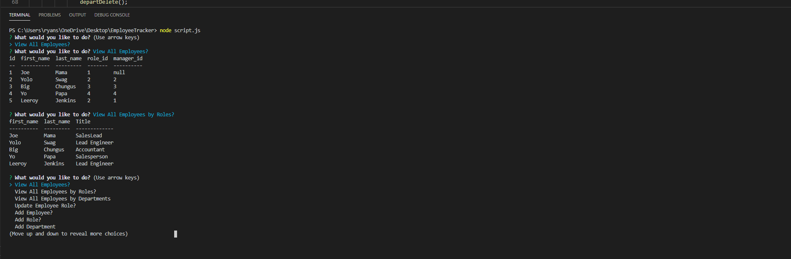

# employeeTracker



# Introduction

Have the user list the employees in the employee tracker allowing the user to check and add different roles employee within the list.

## How to Install

Download the Employee tracker if you want to install and follow the steps.

STEP 1:

Run ```npm i``` or ```npm install```

STEP 2:

Run ``` node script.js ```

## Employee Options

Options:
* View All Employees?
* View All Employees by Roles?
* View All Employees by Departments?
* Update Employee Role?
* Add Employee?
* Add Role?
* Add Department?
* Remove Department
* Exit
